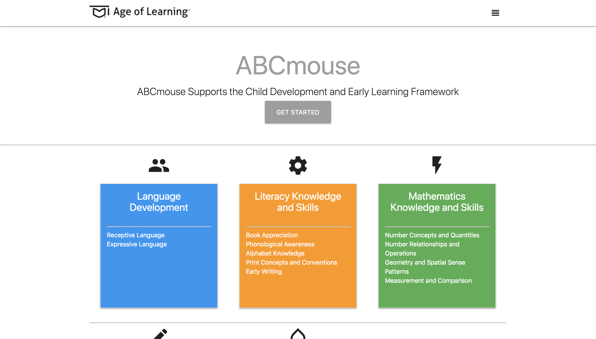
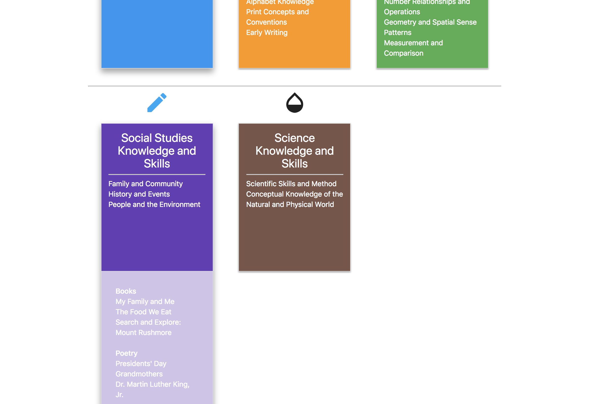
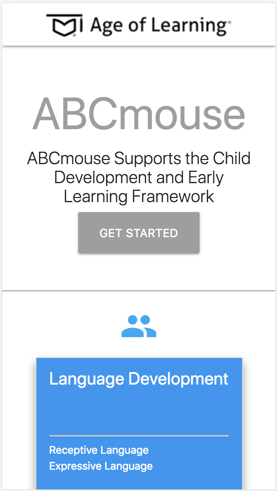

# ABCMouse Frameworks

View different standards and how they correlate with ABCmouse.

## Technical Requirements

* Recreate webpage [Age of Learning](https://www.ageoflearning.com/programs/curriculum/?fbclid=IwAR3VoUPoakFzJXT1tXJ4MXnGnUHycHQOIjxW8Wg1ecVjvDXwhY4H3LGhaYI) representation of how standards align with Age of Learning Curriculum
* Utilize the Materialize framework

## Approach Taken

* Reviewed the current screen
* Researched Materialize
* Created a base component for each standard
* Filled in the boilerplate information (footer, header, additional link to ABCmouse)
* Utilized the component to complete the standards for Child Development and Early Learning Framework and Common Core State Standards

## Built With

* [Materialize](https://materializecss.com/) - Framework, hoverable, grid
* [jquery](https://jquery.com/) - Used with Materialize framework

## Referenced

* [Age of Learning](https://www.ageoflearning.com/) - Standards, Alignments

## Unsolved Problems

* Create a Component using React.
* Create a json file or array to store the data for each component.  May consider using MongoDB if more data is used.
* Add links to individual activities.
* Add quick copy for teacher ease for creating lesson plans.

## Interesting Notes

* New meal plans are generated each week
* The user can generate a meal plan from their profile page
* The user can adjust their settings as they lose or gain weight to see their individual macronutrient suggestions

## Next Steps

* Create meal plans based on user preferences
* Meal should be displayed on calendar until the amount of servings are out

## Authors

* [JustinPMitchell](https://github.com/JustinPMitchell)

## Acknowledgments

* Special Thanks to Jordan Krissi
* Inspiration came from Age of Learning